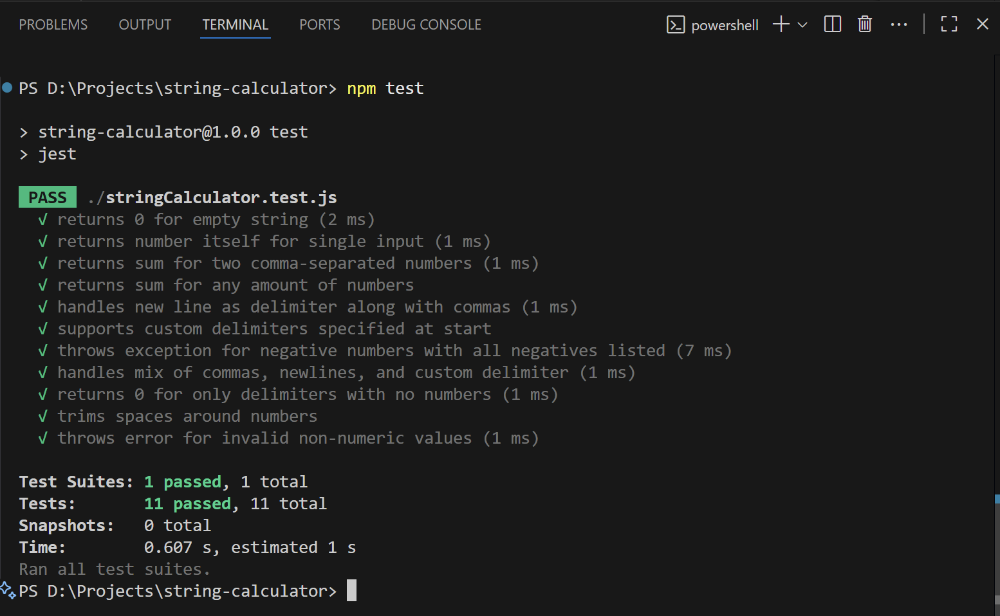

# String Calculator TDD Kata

This is an implementation of the String Calculator kata using Test Driven Development (TDD).

## Features
- Returns 0 for empty string
- Returns number itself for single input
- Supports two or more numbers separated by commas
- Supports new line `\n` as a delimiter
- Supports custom delimiters (e.g., `//;\n1;2`)
- Throws exception for negative numbers with all negatives listed

## Run Locally
```bash
git clone <repo-url>
cd string-calculator
npm install
npm test
```

## Screenshots

All tests passing


